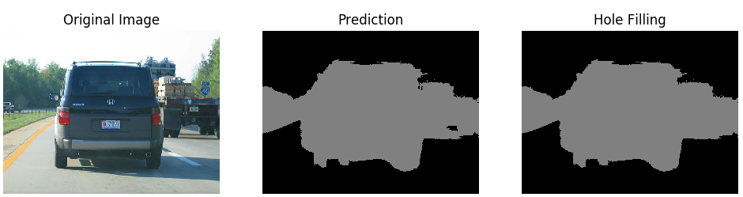

# Hole Filling Algorithm
## Hole Filling
For image semantic segmentation, we usually obtain an initial prediction
from some segmentation algorithm (like FCN). But there might be some false
negative regions (background holes), we would like to manually fill those holes 
with the surrounding foreground labels. The hole filling algorithm is
rather simple. We only need to count the neighbors of each background
holes and fill those with exactly one neighbor.


## Implementation
Since Python is not so much efficient at looping, we would like to implement
the algorithm in a C language. Then we write a Python function wrapping the
underlying C code. The Python module `ctypes` provides a very easy way to do
that. So the following summaries this repo:
1. Implement the hole filling algorithm in C;
2. Compile the C code to a shared library `gcc hole_filling.c -fPIC -shared -o libhf.so`
3. Write a Python function to wrap around the underlying C code

## Usage
To use the hole filling algorithm in Python, run the `compile.sh` script to
compile and perform some testing. Then you could use the module like this:
```python
import numpy as np
import hole_filling

m1 = np.random.randint(3, size=(100, 200), dtype=np.int32)
m2 = hole_filling.fill_bg_with_fg(m1) # m1 must be type int32
```
